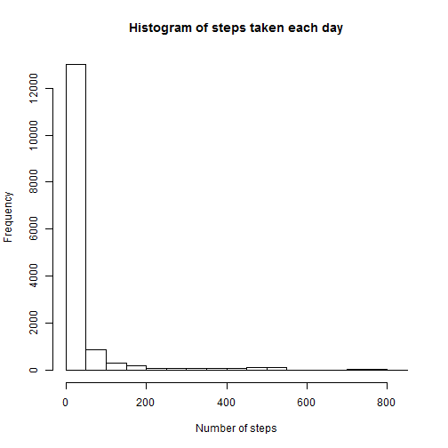
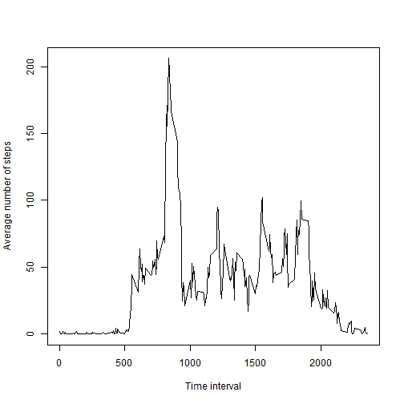
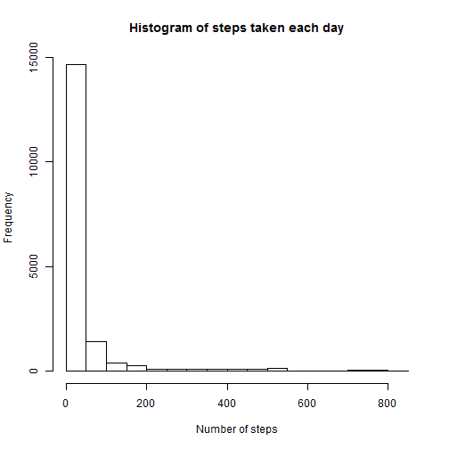

# Reproducible Research: Peer Assessment 1


## Loading and preprocessing the data


```r
library(knitr)
library(ggplot2)
library(reshape2)

activity <- read.csv("../data/activity.csv")
str(activity)
```

```
## 'data.frame':	17568 obs. of  3 variables:
##  $ steps   : int  NA NA NA NA NA NA NA NA NA NA ...
##  $ date    : Factor w/ 61 levels "2012-10-01","2012-10-02",..: 1 1 1 1 1 1 1 1 1 1 ...
##  $ interval: int  0 5 10 15 20 25 30 35 40 45 ...
```

```r
activity$interval <- factor(activity$interval)
activity$date <- as.Date(activity$date, format="%Y-%m-%d")
```

## What is mean total number of steps taken per day?

```r
hist(activity$steps, main="Histogram of steps taken each day", xlab="Number of steps")
```

 

```r
steps_mean <- mean(activity$steps, na.rm=TRUE)
steps_median <- median(activity$steps, na.rm=TRUE)
```
The mean total number of steps taken per day is 37.3826, and the median is 0.


## What is the average daily activity pattern?

```r
adap <- as.data.frame(tapply(activity$steps, activity$interval, mean, na.rm=TRUE))
names(adap) <- "adap"
plot(x=row.names(adap), y=adap$adap,type = "l", xlab="Time interval", ylab="Average number of steps")
```

 

```r
adap_max <- row.names(adap)[which(adap$adap==max(adap$adap))]
```

The 5-minute interval that contains the maximum number of steps, on average across all the days in the dataset is 835.

## Imputing missing values

```r
num_na <- sum(is.na(activity$steps))
activity2 <- activity
activity2$steps[is.na(activity2$steps)] <- adap$adap[match(activity2$interval[is.na(activity2$steps)],row.names(adap))]

hist(activity2$steps, main="Histogram of steps taken each day", xlab="Number of steps")
```

 

```r
steps_mean2 <- mean(activity2$steps)
steps_median2 <- median(activity2$steps)
```

The number of missing values in the steps column is 2304.
We imputed missing values with the daily average of the corresponding interval.
The new mean is 37.3826 and the new median is 0. Both are the same as the estimates without the missing values, so imputation had no effect on these estimates.


## Are there differences in activity patterns between weekdays and weekends?

```r
activity2$day <- factor(weekdays(activity2$date) %in% c("szombat","vasárnap"), labels=c("weekday","weekend")) #szombat is saturday, vasárnap is sunday

adap2 <- as.data.frame(tapply(activity2$steps, list(activity2$interval, activity2$day), mean, na.rm=TRUE))
adap2$interval <- rownames(adap2)
adap2_long <- melt(adap2)
```

```
## Using interval as id variables
```

```r
adap2_long$interval <- as.numeric(adap2_long$interval)

ggplot(data=adap2_long, aes(x=interval,y=value))+geom_line()+facet_grid(variable~.)+ylab("Number of steps")
```

 
